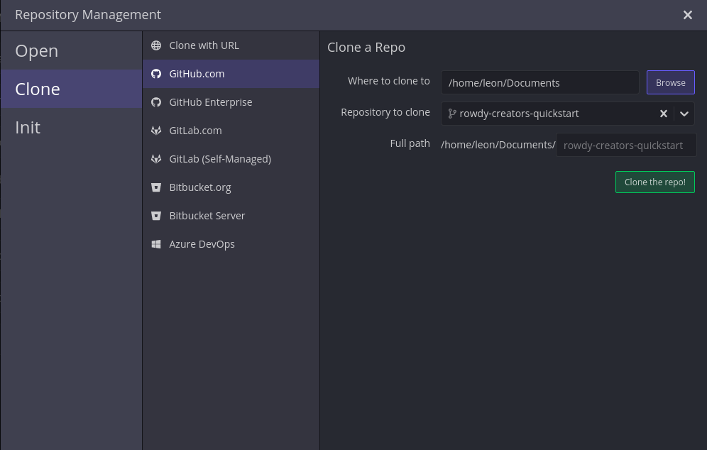
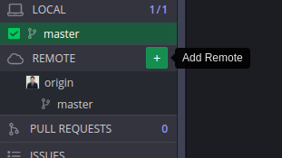
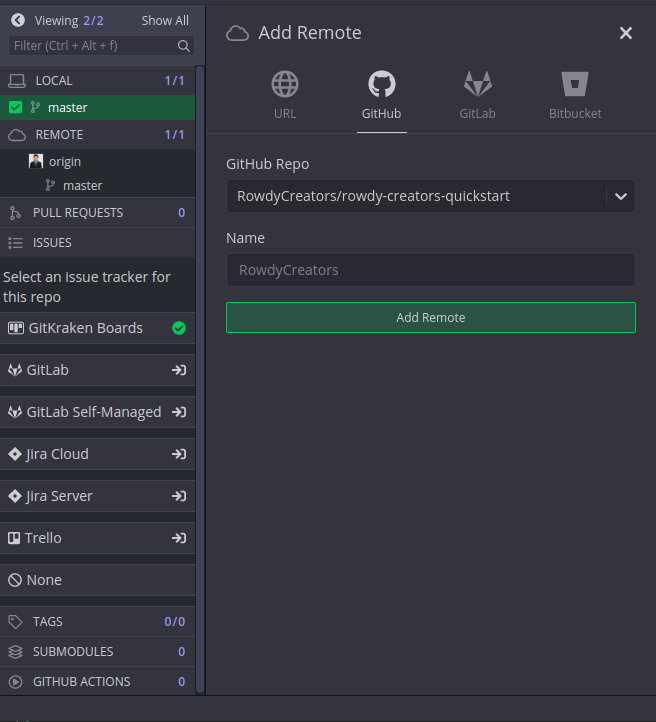
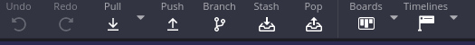
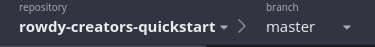
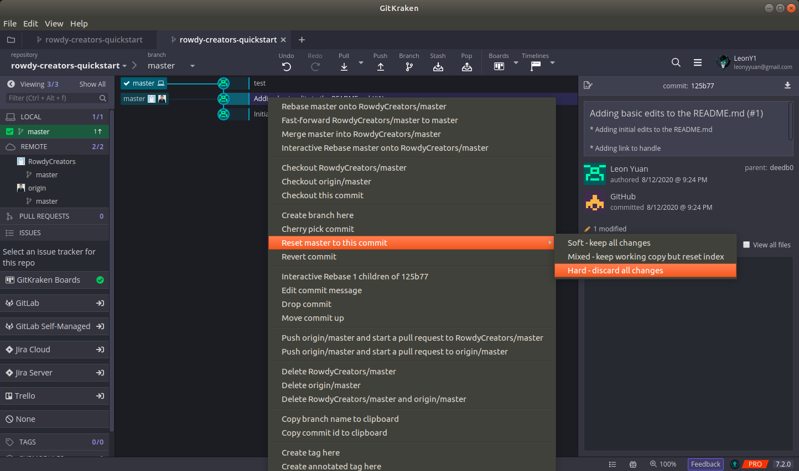

# Contributing to the Organization

All projects should be using Git to handle documentation for the most part. GitHub will be the best location for any code/documentation.

## Contributing to a Project

Reach out to the Project Owner through the Discord channel to see if they are okay with you contributing.

## Learning how to Add to a Project

This can really depend on the Project Owner; however, the best practice to follow is the use of forking and doing pull requests.

### Git Tools

| Tool | Description |
| ---- | -- |
| [Git Kraken](https://www.gitkraken.com/) | Git Kraken is a good Git GUI that will help you acclimate to using Git without working from the command line |
| [GitHub Desktop](https://desktop.github.com/) | GitHub Desktop is another option, but worse than Git Kraken |
| [Git Bash](https://gitforwindows.org/) | Git Bash is primarily for Windows as a good command line tool. You could also use Powershell to accomplish the same tasks, but this download provides Git for Windows. |

### Using Forks

What is a fork? Fork is a way that GitHub represents repositories that are branched from an original. So if RowdyCreators has a repository named `test-project` , you can have the same reference to the `test-project` with a separate repository under your name.

#### How do I fork?

1. Go to the repository that you want to work on

2. Click the Fork button in the top right corner of the page.


Now there is a repository reference under your name.

## Tutorial

If you prefer to use command line, use [this](#using-command-line)

### Using Git Kraken

#### What do I do with my fork?

1. Go to Git Kraken and authenticate yourself with GitHub.

2. Clone the repository



3. Now browse your computer to find the directory where you cloned your repository to.

4. Now you're ready to work!

#### How do I connect my fork to the original?

1. Go to Git Kraken and click `REMOTE`



2. Select the original repository



#### How do I prevent issues keeping my master branch up to date?

Disclaimer: Do your best to not commit on the `master` branch. But this happens, so how do you fix it?

1. Make sure you have all your untracked changes committed or stashed (using the Stash button).



2. Make sure you're on the master branch



3. Make sure your commits line up with the original repository on the master branch. If they're not, follow these steps:

    1. Make sure you click on the commit that the original repository is at

    2. Next we want to reset to that commit



4. Now fetch and merge from the original remote

### Using Command Line

#### What do I do with my fork?

1. Go to your repository on GitHub

2. Copy the git clone link


3. Clone the repository using git:

``` bash
git clone <repository link>
```

4. `cd` into the directory

5. Now you're ready to work!

#### How do I connect my fork to the original?

1. Go to the repository in the command line

2. View your current remote repositories using:

``` bash
git remote -v
```

3. Add in the new remote repository with:

``` bash
git remote add upstream <original repository link>
```

#### How do I prevent issues keeping my master branch up to date?

Disclaimer: Do your best to not commit on the `master` branch. But this happens, so how do you fix it?

1. Go to the repository in the command line

2. Go ahead and fetch the upstream repository updates

``` bash
git fetch --all
```

3. View your current ahead status:

``` bash
git rev-list upstream/master master --count
```

3. Reset to the position for how many commits it's ahead by (given by the statment above). 

For the example given:

``` bash
git reset --hard HEAD~<number_commits_ahead>
```

4. Now you can pull from the upstream remote repository.

``` bash
git pull upstream master
```
