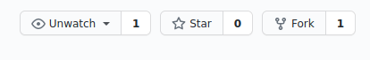
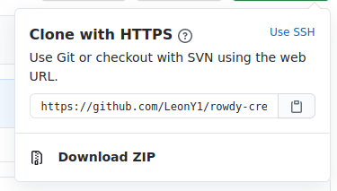

# Contributing to the Organization

All projects should be using Git to handle documentation for the most part. GitHub will be the best location for any code/documentation.

## Contributing to a Project

Reach out to the Project Owner through the Discord channel to see if they are okay with you contributing.

## Learning how to Add to a Project

This can really depend on the Project Owner; however, the best practice to follow is the use of forking and doing pull requests.

### Git Tools

| Tool | Description |
| ---- | -- |
| [Git Kraken](https://www.gitkraken.com/) | Git Kraken is a good Git GUI that will help you acclimate to using Git without working from the command line |
| [GitHub Desktop](https://desktop.github.com/) | GitHub Desktop is another option, but worse than Git Kraken |
| [Git Bash](https://gitforwindows.org/) | Git Bash is primarily for Windows as a good command line tool. You could also use Powershell to accomplish the same tasks, but this download provides Git for Windows. |

### Using Forks

What is a fork? Fork is a way that GitHub represents repositories that are branched from an original. So if RowdyCreators has a repository named `test-project` , you can have the same reference to the `test-project` with a separate repository under your name.

#### How do I fork?

1. Go to the repository that you want to work on

2. Click the Fork button in the top right corner of the page.

Now there is a repository reference under your name.

#### What do I do with my fork?

1. Go to your repository

2. Copy the git clone link

3. 

#### How do I connect my fork to the original?

1. 
